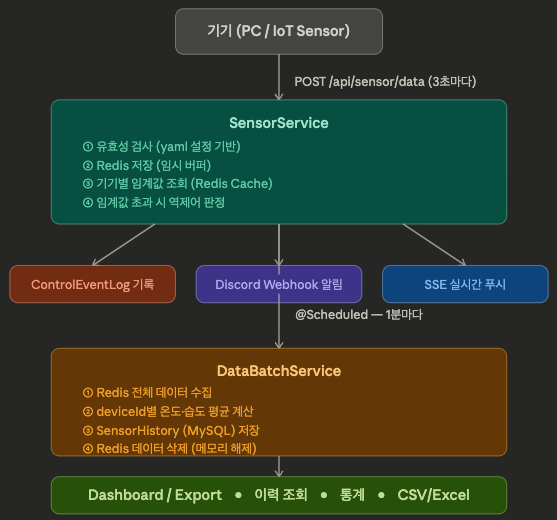

# 🌱 SmartFarm Server

> 🎯 **"IoT 센서 데이터를 실시간으로 수집·분석하고, 임계값 초과 시 자동으로 장치를 역제어하는 스마트팜 모니터링 백엔드"**
>
> 단순한 데이터 저장을 넘어, Redis와 MySQL의 이중 저장소 전략으로 고속 수집과 영구 보관을 동시에 달성했습니다.
>
> Server-Sent Events(SSE) 기반 실시간 푸시, 1분 단위 배치 집계, Discord 알림까지 실제 운영 환경을 고려한 아키텍처를 구축했습니다.


🔗 **실제 서비스 접속해 보기:** [http://smartfarm.rkqkdrnportfolio.shop/](http://smartfarm.rkqkdrnportfolio.shop/)

🔗 **Swagger API**: [http://smartfarm.rkqkdrnportfolio.shop/swagger-ui/index.html](http://smartfarm.rkqkdrnportfolio.shop/swagger-ui/index.html)


<br>

## 🛠️ Tech Stack & Architecture

### Tech Stack
* **Backend:** Java 21, Spring Boot 3.5.11, Spring Data JPA, Querydsl, Spring Security 6
* **Database & Cache:** MySQL, Redis
* **Realtime:** Server-Sent Events (SSE)
* **Export:** Apache POI (Excel), CSV
* **Notification:** Discord Webhook
* **Docs:** Springdoc OpenAPI (Swagger UI)
* **View:** Thymeleaf

### System Architecture




* **Redis:** 3초마다 쏟아지는 센서 데이터를 메모리에 임시 버퍼링하여 DB 쓰기 부하 차단
* **MySQL:** 1분 평균값만 영구 저장하여 스토리지 효율 극대화
* **Spring Cache (Redis 백엔드):** 기기별 임계값 설정을 캐시하여 매 요청마다 발생하는 DB 조회 제거
* **SSE:** 롱폴링 없이 서버에서 브라우저로 단방향 실시간 스트리밍

<br>

## 💡 주요 기술적 의사결정 및 트러블 슈팅

### 1. ⚡ Redis + MySQL 이중 저장소 전략 (Write-Buffer + Batch Flush)
> **의사결정:** 3초마다 발생하는 고빈도 쓰기 요청을 MySQL이 직접 받지 않도록 Redis를 중간 버퍼로 사용하고, 1분 단위 배치로 집계 후 저장

* **🚨 Issue:** 기기에서 3초마다 온도·습도 데이터를 전송할 경우, 기기 수가 늘어날수록 MySQL에 초당 수십 건의 INSERT가 발생해 DB 병목이 불가피
* **💡 Resolution:**
  * **Redis 임시 버퍼:** 수신 즉시 Redis에 저장 (기기당 최신 1건만 유지, 60초 TTL)
  * **Batch Flush:** `@Scheduled`로 1분마다 Redis 전체 데이터를 읽어 deviceId별 평균값을 계산한 뒤 MySQL에 1행만 삽입
  * **메모리 해제:** 배치 완료 후 Redis 데이터 즉시 삭제
* **📈 성과:** DB INSERT 횟수를 기기당 분당 20건 → 1건으로 절감 (기기 10대 기준 약 95% 감소)

<br>

### 2. 🔄 Spring Cache를 활용한 기기 설정 캐싱
> **의사결정:** 센서 데이터 수신마다 기기별 임계값을 DB에서 조회하는 반복 I/O를 제거하고자 Redis 백엔드 기반 `@Cacheable` 적용

* **🚨 Issue:** 매 센서 요청마다 DeviceConfig를 DB에서 조회하면, 기기 수 증가 시 불필요한 SELECT 쿼리가 선형으로 증가
* **💡 Resolution:**
  * **`@Cacheable`:** 기기 설정 최초 조회 시 Redis에 캐싱하여 이후 요청은 DB 접근 없이 처리
  * **`@CacheEvict`:** 기기 설정 변경/삭제 시 캐시 즉시 무효화하여 데이터 정합성 유지
* **📈 성과:** 설정 조회 쿼리를 캐시 히트 시 0회로 감소, 임계값 판정 로직의 응답 속도 개선

<br>

### 3. 📡 Server-Sent Events(SSE) 기반 실시간 모니터링
> **의사결정:** 브라우저에서 최신 센서 데이터를 보여주기 위해 폴링 대신 SSE로 서버 주도 푸시 방식 채택

* **🚨 Issue:** 3초마다 브라우저가 API를 폴링하면 불필요한 HTTP 오버헤드가 발생하고, 다중 탭에서 중복 요청이 급증
* **💡 Resolution:**
  * **SSE 구독:** 브라우저가 `/api/sse/subscribe?deviceId=X`로 연결을 맺으면 서버가 데이터 수신 시 자동으로 푸시
  * **다중 탭 지원:** `ConcurrentHashMap<deviceId, CopyOnWriteArrayList<SseEmitter>>` 구조로 동일 기기를 구독 중인 모든 탭에 동시 푸시
  * **30분 타임아웃:** 장시간 연결 유지 시 리소스 누수 방지
* **📈 성과:** 클라이언트 요청 제거로 서버 부하 감소, 센서 수신 즉시 브라우저 반영

<br>

### 4. 🧹 소프트 딜리트 & 데이터 생명주기 관리
> **의사결정:** 기기 삭제 시 관련 이력 데이터를 즉시 하드 삭제하지 않고 소프트 딜리트 후 스케줄러로 단계적 영구 삭제

* **🚨 Issue:** 기기 삭제 직후 대량의 SensorHistory를 한 번에 하드 삭제하면 DB 락 및 응답 지연이 발생할 위험
* **💡 Resolution:**
  * **소프트 딜리트:** 기기 삭제 시 관련 SensorHistory의 `deletedAt` 필드에 타임스탬프만 기록
  * **1주일 후 하드 삭제:** 매일 03:00 스케줄러가 `deletedAt` 기준 7일 경과 데이터를 배치 삭제
  * **1개월 후 만료 삭제:** 매일 02:00 스케줄러가 오래된 이력 데이터를 자동 정리
* **📈 성과:** 기기 삭제 응답 시간 단축, DB 부하 분산 및 스토리지 자동 관리

<br>

### 5. 📊 Querydsl 기반 통계 쿼리 최적화
> **의사결정:** 오늘의 최고·최저·평균 통계를 애플리케이션 레이어에서 계산하지 않고 DB에 위임하기 위해 Querydsl 도입

* **🚨 Issue:** JPA 메서드 네이밍만으로 집계(max, min, avg)와 날짜 범위 필터를 조합한 동적 쿼리를 표현하기 어려움
* **💡 Resolution:**
  * **Querydsl Projections:** `QSensorStatisticsDto`로 집계 결과를 DTO에 직접 매핑, 엔티티 불필요 조회 제거
  * **BooleanExpression:** 날짜 범위, deviceId 조건을 타입 안전하게 조합
  * **Repository-Custom-Impl 3단 구조:** JPA 인터페이스와 Querydsl 구현체를 분리하여 유지보수성 확보
* **📈 성과:** 집계 로직 DB 위임으로 애플리케이션 메모리 부하 절감, 컴파일 타임 쿼리 검증으로 런타임 오류 사전 차단

<br>

## 📌 API 엔드포인트

### 센서
| Method | URI | 인증 | 설명 |
|--------|-----|------|------|
| POST | `/api/sensor/data` | ❌ | 센서 데이터 수신 |

### 기기 설정
| Method | URI | 인증 | 설명 |
|--------|-----|------|------|
| GET | `/api/device-config` | ✅ | 전체 기기 목록 조회 |
| GET | `/api/device-config/{deviceId}` | ✅ | 특정 기기 설정 조회 |
| POST | `/api/device-config` | ✅ | 기기 설정 저장/수정 |
| DELETE | `/api/device-config/{deviceId}` | ✅ | 기기 삭제 |

### 대시보드
| Method | URI | 인증 | 설명 |
|--------|-----|------|------|
| GET | `/api/dashboard/history` | ✅ | 센서 이력 페이징 조회 |
| GET | `/api/dashboard/statistics/today` | ✅ | 오늘 통계 조회 |
| GET | `/api/dashboard/export/csv` | ✅ | CSV 내보내기 |
| GET | `/api/dashboard/export/excel` | ✅ | Excel 내보내기 |

### 실시간
| Method | URI | 인증 | 설명 |
|--------|-----|------|------|
| GET | `/api/sse/subscribe` | ✅ | SSE 구독 |

> 📄 **Swagger UI:** `http://localhost:8080/swagger-ui/index.html`

<br>

## ⚙️ 실행 방법

### 사전 요구사항
* Java 21
* MySQL — `localhost:3306` / DB: `smartfarm`
* Redis — `localhost:6380`

### 환경변수
| 변수 | 설명 |
|------|------|
| `DISCORD_WEBHOOK_URL` | Discord 알림 웹훅 URL |

### 실행
```bash
./gradlew bootRun
```

### 테스트 계정 (로컬 전용)
애플리케이션 최초 시작 시 자동 생성됩니다.

| 항목 | 값 |
|------|----|
| username | `admin` |
| password | `admin1234` |

> ⚠️ 로컬 개발 및 테스트 전용 계정입니다. 실제 운영 환경에서는 반드시 변경하세요.

<br>

## 🚨 예외 처리

| 코드 | HTTP | 설명 |
|------|------|------|
| E001 | 400 | 입력값 오류 |
| E002 | 400 | 기기 없음 |
| S001 | 500 | 서버 내부 오류 |
| S002 | 500 | 데이터베이스 오류 |


---

최근 업데이트 2026.03.25 -README V1.0.0